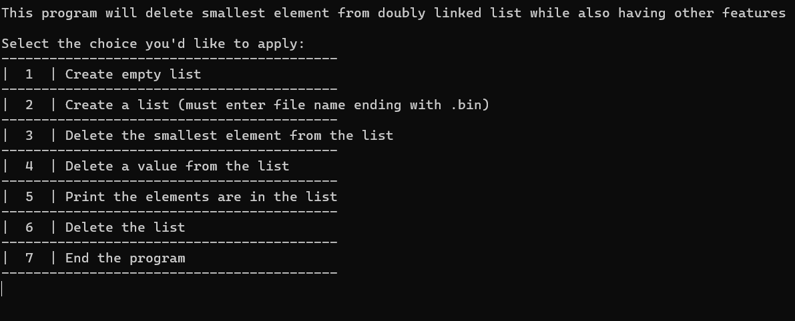
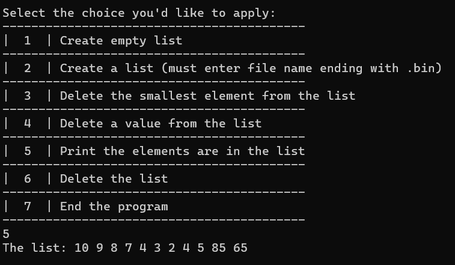

# Doubly Linked List

This project implements a custom interactive doubly linked list in C. It supports dynamic memory allocation to store integer data, load sequences from binary files, and search out specific elements for deletion.

## Technical Details
* Language: C.

## File Structure
* file.h: Defines the core structural blueprints and lists function signatures.
* file.c: Contains individual logic modules for populating, finding, and freeing data nodes.
* main.c: Loops control engine and handles input collection.

## Compilation and Running

To compile all dependencies into a single binary program, run the following command in your console:

gcc main.c file.c -o doubly_linked_list

To execute the application after compiling, simply click the doubly_linked_list.exe

## Note

The code does need .bin file to be able to load the list

## Screenshots

Below are visual examples of the program running on the terminal.

### Interactive Menu Selection

### Loading Data
